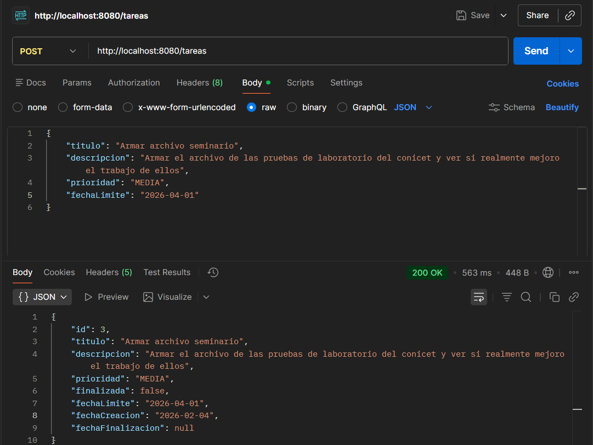
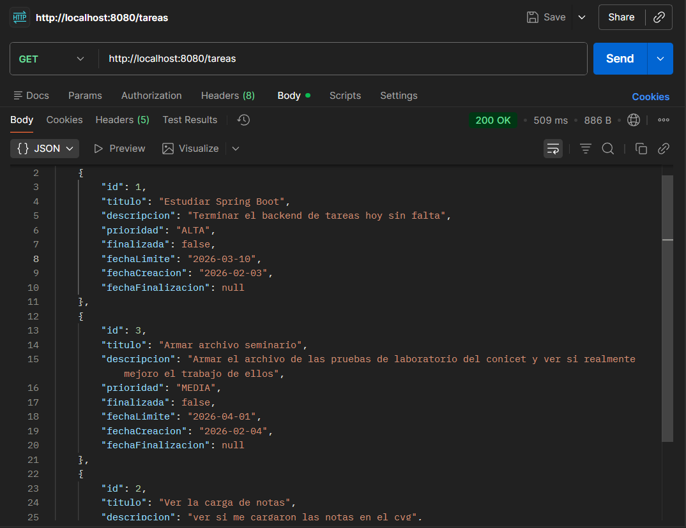

# 🚀 Java Learning Path - Franco Oyhenart

Hola, soy **Franco Oyhenart**, estudiante de Ingeniería en Sistemas (UTN La Plata).
Este repositorio funciona como mi bitácora de aprendizaje. Acá subo desde los ejercicios básicos de cuando arranqué hasta los proyectos que estoy construyendo ahora con Spring Boot.

La idea es documentar el progreso real: de la lógica básica a la construcción de APIs.

## 🗺️ Etapas de Aprendizaje

### 🏁 Fase 1: Fundamentos
Mis primeros pasos en Java.
* **Enfoque:** Entender la sintaxis estricta, tipos de datos y estructuras de control.
* **Resumen:** Muchos errores de compilación y aprender a pensar con la lógica de Java.

### 🧩 Fases 2, 3 y 4: Programación Orientada a Objetos (POO)
Acá empecé a organizar el código en serio.
* **Enfoque:** Clases, Herencia, Colecciones, Maven, manejo de excepciones (try/catch), Streams y Lambdas.
* **Cambio clave:** Dejé de escribir todo en un solo archivo `main`. Aprendí a separar el código en componentes lógicos, comunicar clases entre sí y modularizar para no repetir lógica.

### 🔥 Fase 5: Spring Boot & Backend (Actualidad)
El salto al desarrollo web. Dejé la consola para crear aplicaciones que funcionan en un servidor.
* **Tecnologías:** Spring Boot 3, JPA, PostgreSQL (Supabase) y Postman.
* **Logro:** Construir APIs REST que reciben peticiones, procesan datos y los guardan en una base de datos real.

---

## 📂 Mis Proyectos

En la carpeta `/Proyectos` voy subiendo las aplicaciones funcionales que desarrollo para aplicar lo aprendido.

### 1. Gestor de Tareas (API REST)
*Ubicación: `/Proyectos/gestor-tareas`*

Mi primer proyecto backend completo. Es una API para gestionar tareas diarias.

#### 📸 Demo de Funcionalidad

**1. Crear una Tarea (POST):**

**2. Listar todas las Tareas (GET):**

* **Tech Stack:** Java 21, Spring Boot, PostgreSQL.
* **Qué hace:**
  * CRUD completo (Crear, Leer, Actualizar, Borrar).
  * Validaciones lógicas (ej: no permitir fechas pasadas).
  * Manejo de estados y prioridades usando Enums.
* **Testing:** Incluí la colección de Postman en la carpeta `docs` para probar los endpoints.

---

## 🎯 Objetivo
Seguir profundizando en Backend.
* **Próximos pasos:** Mejorar seguridad (Spring Security), validaciones complejas y aprender a contenerizar aplicaciones con **Docker**.
